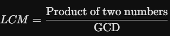

1. Number Categories & Greatest Value
    Write a program to input three numbers (positive or negative). If they are unequal, then display the greatest number; otherwise, display that they are equal. The program also displays whether the numbers entered by the user are 'All positive', 'All negative', or 'Mixed numbers'.
    * Sample Input: 56, -15, 12
    * Sample Output: * The greatest number is 56
    * Entered numbers are mixed numbers.

------------------------------------------------------------------------------------------------------------------------------------------------------------------------

2. Equable Triangle
    A triangle is said to be an 'Equable Triangle' if the area of the triangle is equal to its perimeter. Write a program to enter three sides of a triangle. Check and print whether the triangle is equable or not.
    * *Example:* A right-angled triangle with sides 5, 12, and 13 has its area and perimeter both equal to 30.

------------------------------------------------------------------------------------------------------------------------------------------------------------------------

3. Special Two-Digit Number 
    A special two-digit number is such that when the sum of its digits is added to the product of its digits, the result is equal to the original two-digit number.
    * *Example:* Consider the number 59.
    * Sum of digits = 5 + 9 = 14
    * Product of digits = 5 * 9 = 45
    * Total of the sum of digits and product of digits = 14 + 45 = 59

    * Task: Write a program to accept a two-digit number. Add the sum of its digits to the product of its digits. If the value is equal to the number input, display the message "Special 2 - digit number"; otherwise, display the message "Not a special two-digit number".

------------------------------------------------------------------------------------------------------------------------------------------------------------------------

4. Nature and Roots of a Quadratic Equation
    The standard form of a quadratic equation is given by ax^2 + bx + c = 0, where d = b^2 - 4ac is known as the discriminant that determines the nature of the roots of the equation as:
    * If d \ge 0: Roots are real
    * If d < 0: Roots are imaginary

    Task: Write a program to determine the nature and the roots of a quadratic equation, taking a, b, c as input. If d = b^2 - 4ac is greater than or equal to zero, then display 'Roots are real'; otherwise, display 'Roots are imaginary'. The roots are determined by the formulas:

    [Formula](image.png)

------------------------------------------------------------------------------------------------------------------------------------------------------------------------

5. Niven Number 
    Write a program to input a number. Check and display whether it is a Niven number or not. (A number is said to be Niven if it is divisible by the sum of its digits).
    * Sample Input: 126
    * Explanation: Sum of its digits = 1 + 2 + 6 = 9, and 126 is divisible by 9.

------------------------------------------------------------------------------------------------------------------------------------------------------------------------

6. Perfect Number
    Write a program to accept a number and check whether the number is perfect or not. A number is said to be perfect if the sum of its factors (including 1 and excluding the number itself) is the same as the original number.
    * Sample Input: 6
    * Sample Output: It is a perfect number.
    * Explanation: The factors of 6 are 1, 2, 3 and 1 + 2 + 3 = 6.

------------------------------------------------------------------------------------------------------------------------------------------------------------------------

7. Neon Number
    Write a program to enter a number and check whether the number is 'Neon' or not. A number is said to be 'Neon' if the sum of the digits of the square of the number is equal to the number itself.
    * Sample Input: 9
    * Sample Output: 9 * 9 = 81 -> 8 + 1 = 9 : 9 is a Neon number.

------------------------------------------------------------------------------------------------------------------------------------------------------------------------

8. Armstrong Number
    Write a program  to enter a three-digit number and check whether the number is an Armstrong number or not. (A three-digit number is said to be Armstrong if the sum of the cubes of its digits is equal to the original number.)
    * Sample Input: 153
    * Sample Output: 153 is an Armstrong Number because 1^3 + 5^3 + 3^3 = 153.
    * *Note:* An Armstrong number is more broadly defined as a number which is equal to the sum of its digits raised to the power of the total number of digits in the number (e.g., 1634 = 1^4 + 6^4 + 3^4 + 4^4).

------------------------------------------------------------------------------------------------------------------------------------------------------------------------

9. Automorphic Number
    An Automorphic number is a number which is contained in the last digit(s) of its square. Write a program to input a number and check whether the number is Automorphic or not.
    * Sample Input: 25
    * Explanation: The square of 25 is 625, and 25 is present as the last two digits.
    * Sample Output: 25 is an Automorphic Number.

------------------------------------------------------------------------------------------------------------------------------------------------------------------------

10. Greatest Common Divisor (G.C.D)
    Write a program to accept two numbers and find the Greatest Common Divisor (G.C.D) of those numbers.
    * Sample Input: 25, 45
    * Sample Output: The Greatest Divisor: 5
    * *Bonus Formula for LCM:* 
    

------------------------------------------------------------------------------------------------------------------------------------------------------------------------

11. Positive Even and Negative Odd Sum
    You want to calculate the sum of all positive even numbers and the sum of all negative odd numbers from a set of numbers. You can enter 0 (zero) to quit the program and display the results. Write a program to perform this task.

------------------------------------------------------------------------------------------------------------------------------------------------------------------------

12. Menu-Driven Composite & Smallest Digit 
    Using a switch statement, write a menu-driven program to perform the following tasks:
    * (i) To check and display whether a number input by the user is a composite number or not. (A number is said to be composite if it has one or more factors excluding one and the number itself, e.g., 4, 6, 8, 9...).
    * (ii) To find the smallest digit of an integer that is input.
    * *Sample Input:* 6524
    * *Sample Output:* Smallest digit is 2.

    * *For an incorrect choice, an appropriate error message should be displayed.*

------------------------------------------------------------------------------------------------------------------------------------------------------------------------

13. Pronic Number
    Write a program to input a number and check and print whether it is a Pronic number or not. (A Pronic number is a number which is the product of two consecutive integers, such as 12 = 3 * 4, 20 = 4 * 5, 42 = 6 * 7).

------------------------------------------------------------------------------------------------------------------------------------------------------------------------

14. Twisted Prime 
    A prime number is said to be a Twisted Prime if the new number obtained after reversing its digits is also a prime number. Write a program to accept a number and check whether the number is a Twisted Prime or not.
    * Sample Input: 167
    * Sample Output: 761 (Since 167 and 761 are both prime, 167 is a Twisted Prime).

------------------------------------------------------------------------------------------------------------------------------------------------------------------------

15. Next Prime Number
    Write a program to input a number and check whether it is a prime number or not. If it is not a prime number, then display the next consecutive number that is prime.

------------------------------------------------------------------------------------------------------------------------------------------------------------------------

16. Duck Number
    A number is said to be a Duck number if the digit zero (0) is present in it. Write a program to accept a number and check whether the number is a Duck number or not. The number must not begin with zero.
    * Sample Input: 7453 -> Output: It is a Duck number.
    * Sample Input: 5063 -> Output: It is a Duck number.

------------------------------------------------------------------------------------------------------------------------------------------------------------------------

17. Binary Conversion
    Write a program to input a number and display its Binary equivalent.
    * Sample Input: (21)_{10}
    * Sample Output: (10101)_2

------------------------------------------------------------------------------------------------------------------------------------------------------------------------

18. Bus Fare Calculation
    A computerized bus charges fare from each of its passengers based on the distance traveled. On entering the distance, it prints their ticket and the control goes back for the next passenger. At the end of the journey, the computer prints:
    * (i) The total number of passengers traveled
    * (ii) Total fare received
    * Task: Write a program to perform this task based on a user-controlled loop.

------------------------------------------------------------------------------------------------------------------------------------------------------------------------

19. Special Two-Digit Number Alternative 
    Write a program to accept a two-digit number. Add the sum of its digits to the product of its digits. If the value is equal to the number input, then display the message "Special two-digit number"; otherwise, display the message "Not a special two-digit number". (Refer to Question 3 for the complete mathematical example layout).

------------------------------------------------------------------------------------------------------------------------------------------------------------------------

20. Abundant Number
    An abundant number is a number for which the sum of its proper divisors (excluding the number itself) is greater than the original number. Write a program to input a number and check whether it is an abundant number or not.
    * Sample Input: 12
    * Explanation: Its proper divisors are 1, 2, 3, 4, and 6. Their sum is 1 + 2 + 3 + 4 + 6 = 16, which is greater than 12.
    * Sample Output: It is an abundant number.

------------------------------------------------------------------------------------------------------------------------------------------------------------------------

21. Spy Number
    Write a program to accept a number and check whether it is a Spy Number or not. (A number is a spy number if the sum of its digits equals the product of its digits).
    * Sample Input: 1124
    * Explanation: Sum of digits = 1 + 1 + 2 + 4 = 8. Product of digits = 1 * 1 * 2 * 4 = 8.

------------------------------------------------------------------------------------------------------------------------------------------------------------------------

22. Harshad Number 
    Write a program to input a number and check whether it is a Harshad Number or not. (A number is said to be a Harshad number if it is divisible by the sum of its digits).
    * Sample Input: 132 -> Sum of digits = 1+3+2=6. Since 132 is divisible by 6, Output: It is a Harshad Number.
    * Sample Input: 353 -> Output: It is not a Harshad Number.

------------------------------------------------------------------------------------------------------------------------------------------------------------------------

23. Pronic Numbers in a Range
    Write a program to display all Pronic numbers in the range from 1 to n. (A Pronic number takes the structural form of n * (n+1), such as 2, 6, 12, 20, 30, etc.).

------------------------------------------------------------------------------------------------------------------------------------------------------------------------

26. Menu-Driven Tribonacci & Sunny Numbers
    Write a menu-driven program to perform the following tasks:
    * (a) Generate the first 20 terms of the Tribonacci sequence. Tribonacci numbers are formed by adding the three previous terms (e.g., 1, 1, 2, 4, 7, 13, 24...).
    * (b) Display all Sunny numbers in the range from 1 to n. (A number is a sunny number if the square root of (n+1) evaluates to an integer, e.g., 3, 8, 15, 24, 35...).
    * *For an incorrect option, display an appropriate error message.*

------------------------------------------------------------------------------------------------------------------------------------------------------------------------

27. Digit Sorting (Ascending Order)
    Write a program  to enter a number containing three digits or more. Arrange the digits of the entered number in ascending order and display the result.
    * Sample Input: 4972
    * Sample Output: 2, 4, 7, 9

------------------------------------------------------------------------------------------------------------------------------------------------------------------------

28. Magic Number
    Write a program to input a number and check whether it is a Magic Number or not. A number is a magic number if the eventual single-digit sum of its digits is equal to 1.
    * Sample Input: 55 -> Calculation: 5 + 5 = 10 -> 1 + 0 = 1.
    * Sample Output: Hence, 55 is a Magic Number. (289 is also a magic number).

------------------------------------------------------------------------------------------------------------------------------------------------------------------------

29. Multiple Harshad Number
    A number is said to be a Multiple Harshad number when, after being divided by the sum of its digits, it produces another Harshad Number sequence continuously until a single digit is reached. Write a program to input a number and check whether it is a Multiple Harshad Number or not.
    * Sample Input: 6804
    * Verification Path: * 6804 -> 6+8+0+4 = 18 -> 6804 / 18 = 378
    * 378 -> 3+7+8 = 18 -> 378 / 18 = 21
    * 21 -> 2+1 = 3 -> 21 / 3 = 7

    * Sample Output: Multiple Harshad Number

------------------------------------------------------------------------------------------------------------------------------------------------------------------------

30. Pattern Generation Console Matrix
    Write individual programs to display the following requested console patterns:

    (a)                  (b)                  (c)
    1                    1  2  3  4  5        15 14 13 12 11
    3 1                  6  7  8  9           10 9  8  7
    5 3 1                10 11 12             6  5  4
    7 5 3 1              13 14                3  2
    9 7 5 3 1            15                   1

    (d)                  (e)                  (f)
    1                    5 5 5 5 5            1 2 3 4 5
    1 0                    4 4 4 4            2 2 3 4 5
    1 0 1                    3 3 3            3 3 3 4 5
    1 0 1 0                    2 2            4 4 4 4 5
    1 0 1 0 1                    1            5 5 5 5 5

    (g)                  (h)                  (i)
    *                    5 4 3 2 1            1
    * #                  5 4 3 2              2 3
    * # *                5 4 3                4 5 6
    * # * #              5 4                  7 8 9 10
    * # * # *            5                    11 12 13 14 15

------------------------------------------------------------------------------------------------------------------------------------------------------------------------

31. Dynamic Triangle/Inverted Triangle 
    Write a program to generate a triangle or an inverted triangle till n terms based upon the user's choice.
    * Choice 1 (Normal Triangle Output):
    * Input Choice: 1, Number of terms: 5
    * *Output:*

    1
    2 2
    3 3 3
    4 4 4 4
    5 5 5 5 5

    * Choice 2 (Inverted Triangle Output):
    * Input Choice: 2, Number of terms: 6
    * *Output:*

    6 6 6 6 6 6
    5 5 5 5 5
    4 4 4 4
    3 3 3
    2 2
    1

------------------------------------------------------------------------------------------------------------------------------------------------------------------------

32. Menu-Driven Patterns 
    Using the switch statement, write a menu-driven program for the following layouts:
    * (a) To print Floyd's triangle:

    1
    2 3
    4 5 6
    7 8 9 10
    11 12 13 14 15

    * (b) To display the word string pattern:

    I
    I C
    I C S
    I C S E

    * *For an incorrect option, display an appropriate error message.*

------------------------------------------------------------------------------------------------------------------------------------------------------------------------

33. Menu-Driven Prime Factors & Multiplication Tables
    Using the switch case statement, write a menu-driven program for the following assignments:
    * (a) To input a number and display only those factors of the number which are prime.
    * *Sample Input:* 84 -> *Sample Output:* 2, 3, 7

    * (b) A program that displays a grid-based multiplication table layout from 1 to 10 as shown below:

    1 2 3 4 5 6 7 8 9 10
    2 4 6 8 10 12 14 16 18 20
    3 6 9 12 15 18 21 24 27 30
    ..........................
    9 18 27 36 45 54 63 72 81 90
    10 20 30 40 50 60 70 80 90 100

